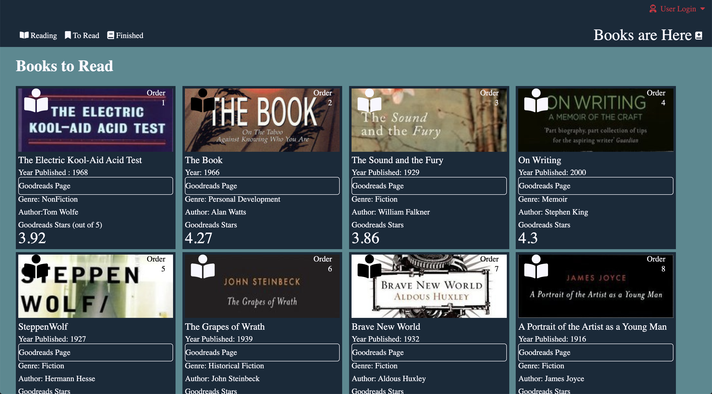
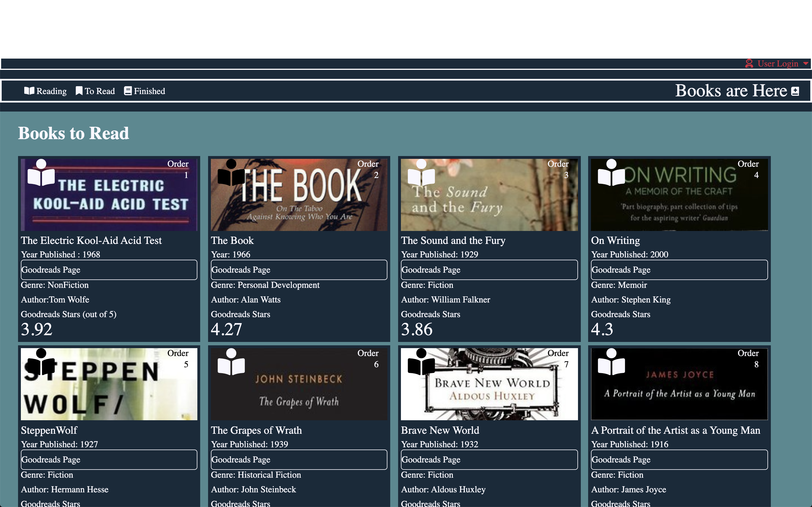

### Taylor Johnson Static Comp

[Link to my Github](https://github.com/taylorjohnson141)

[Link to Project Repo](https://github.com/taylorjohnson141/tj-comp-challenge-1)

[Link to Project GitHub Page](https://taylorjohnson141.github.io/tj-comp-challenge-1/)

#### Static Comp

In this project we were required to create a responsive web page following the exact layout of this image.

We were allowed freedom to change the content included but not to change the layout itself.

I chose the theme of books.

The project was intended for us to practice and strengthen our HTML and CSS.

After completing the project I have a better understanding of the following concepts:

* CSS Grid
* CSS FlexBox
* The Box Model
* Html Tags
* Media Queries
* Normalize.CSS
* Design

In my project I used both FlexBox and Grid
I used FlexBox in the Header of my project(The white borders show the flex containers)

In my section I used Grid to layout items in the section by 4 by 2 (The white borders show the grid items)

For the project I tried to make it a responsive as possible by mixing media queries and responsive units.

Here is my first media query being triggered at 80em. The media query makes the grid 3 by 3 and changes the header layout:

Here is my second Media Query being triggered at 50ems:

 The media query makes the grid 2 by 4 and changes the text size of the Goodreads rating as well as changing the header layout.

#### Reflection
If I were to do this project again with my current knowledge I would improve the project in the following ways:

* I would like to make my website responsive for all screen sizes. (It is still finicky with smaller screens)

* I would also like to find a way to avoid using the important command in css

* I would like to get the layout down exact, I can see where it is slightly different than the original still.  
